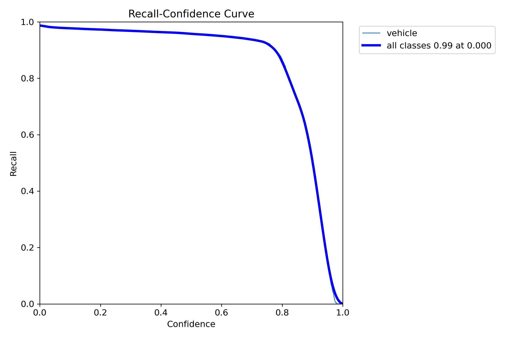
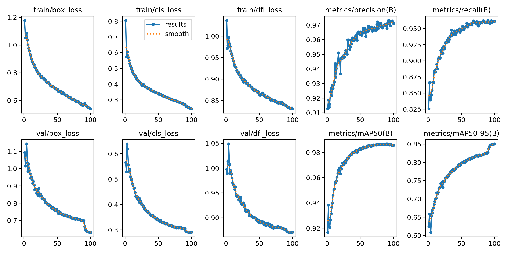

# Vehicle Detection and Tracking( Yolov8 + SORT )

In this repository I have trained yolov8m on KITTI Dataset and urban Traffic Surveillance (UTS) dataset for vehicle Detection and used SORT Tracking algorithm for tracking vehicles

<details>

<summary> YOLOv8 Model Training on Custom Dataset </summary>

## Datasets Introduction   

<b>KITTI Dataset</b>

KITTI is 2D object detection and orientation estimation benchmark Dataset; it consists of 7481 training images and 7518 testing images. The benchmark uses 2D bounding box overlap to compute precision-recall curves for detection and computes orientation similarity to evaluate the orientation estimates in bird's eye view.
Kitti datsets is captured by driving around the mid-size city of Karlsruhe, in rural areas and on highways. Up to 15 cars and 30 pedestrians are visible per image.


<b>Urban Traffic Surveillance (UTS) Dataset</b>

The Urban Traffic Surveillance (UTS) dataset is collected with six videos which were captured from different viewpoints and illumination conditions. All the vehicles are annotated with bounding box, viewpoint, type and color. 

## Yolov8m Training and Dataset Preparation

The included code, which is in form of Ipython Notebook, downloads the dataset and perform processing.

## Colab Notebook
The code needed to preprocess the data and train the model is available in the following notebook.
Set the runtime to GPU and run everything.

[](https://github.com/muhammad-umair-usmani/Vehicle_Detection_Tracking/blob/main/vehicle_dataset_preparation+yolov8_training.ipynb)

## Yolov8m Weights and checkpoint to resume training

The [weights](https://github.com/muhammad-umair-usmani/Vehicle_Detection_Tracking/blob/main/runs/detect/train) are also available to run using the official yolov8 code found [here](https://github.com/ultralytics/ultralytics)


<b>you can find trained model checkpoint, tensorboard logs and weights at path "./runs/detect/train/"</b>

Finally yolov8m is trained. Below are training metrics and performance images

<p float="left">
  
  
  
  
</p>
<p float="left">
  
</p>

<p float="left">
  
  
</p>

## labels correlogram
<p float="left">
  
  
</p>

## Results


</details>

<details>

<summary><b>Inference</b></summary>

```python

from ultralytics import YOLO

model = YOLO("path to model yolov8m")
result = model.predict("path to img")[0]
bboxes = np.array(result.boxes.xywh)

```

</details>

<details open>
<summary> <b>Tracking</b></summary>

## Vehicle Tracking 

Custom object detection architecture

The trackers provided in this repo can be used with other object detectors than Yolov8.

For tracking please run below file

```bash
$ python Track.py --video_path <"video input path"> --output <"video output path">\ --model_path <"yolov8m weights">
```


To obtain vehicle counting results on distinct runways, utilize the "Detection_tracking_inference.ipynb" file.

# Detection and Tracking results
[](https://youtu.be/AisUbJo4vYQ)

[](https://youtu.be/UvWd7B-HVKo)

</details>

